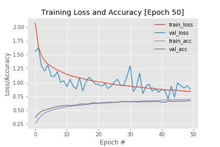
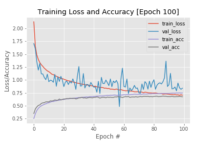

# Facial-Expression-Recognition-Challenge

# Dataset

The Kaggle Emotion and Facial Expression Recognition challenge training dataset consists of
28,709 images, each of which are 48×48 grayscale images (Figure 11.1). The faces have been
automatically aligned such that they are approximately the same size in each image. Given these
images, our goal is to categorize the emotion expressed on each face into seven distinct classes:
angry, disgust, fear, happy, sad, surprise, and neutral.

Download the dataset: <a href="https://www.kaggle.com/c/challenges-in-representation-learning-facial-expression-recognition-challenge/data">here</a>

seven categories of labels are 0=Angry, 1=Disgust, 2=Fear, 3=Happy, 4=Sad, 5=Surprise, 6=Neutral

after downloading `fer2013.tar.gz` unzip it and put `fer2013.csv` file in `fer2013/fer2013` directory 

# Files
1. emotion_config.py: This file is where we’ll store any configuration variables, including paths to the input dataset, output HDF5 files, and batch sizes
2. build_dataset.py: This file is responsible for ingesting the fer2013.csv dataset file and outputting set a set of HDF5 files; one for each of the training, validation, and testing splits, respectively
3. train_recognizer.py: This file is used to train CNN to recognize various emotions.
4. test_recognizer.py: This file is used to evaluate the performance of CNN.
5. emotion_detector.py: This file is used to Detect faces in real-time and Apply our CNN to recognize the most dominant emotion and display the probability distribution for each emotion.

# How to run??

To run `build_dataset.py`, Execute following command

`python build_dataset.py`

and you will get three files named `train.hdf5`, `test.hdf5` and `val.hdf5` inside `fer2013/hdf5` directory

To run `train_recognizer.py`, Execute following command

`python train_recognizer.py --checkpoints checkpoints`

and you will get 20 files named from `epoch_5.hdf5` to `epoch_100.hdf5` inside `checkpoints/vgg100` directory

# Results

If you are training for `50` epochs

[INFO] compiling model... 
Epoch 1/50 
224/224 [==============================] - 22s 97ms/step - loss: 2.0768 - accuracy: 0.2606 - val_loss: 1.5601 - val_accuracy: 0.3708 
Epoch 2/50 
224/224 [==============================] - 14s 63ms/step - loss: 1.6391 - accuracy: 0.3475 - val_loss: 1.6220 - val_accuracy: 0.4343 
Epoch 3/50 
224/224 [==============================] - 15s 67ms/step - loss: 1.4812 - accuracy: 0.4071 - val_loss: 1.2894 - val_accuracy: 0.4837 
Epoch 4/50 
224/224 [==============================] - 16s 73ms/step - loss: 1.3881 - accuracy: 0.4509 - val_loss: 1.2082 - val_accuracy: 0.5013 
Epoch 5/50 
224/224 [==============================] - 15s 66ms/step - loss: 1.3318 - accuracy: 0.4774 - val_loss: 1.3157 - val_accuracy: 0.5175 
Epoch 6/50 
224/224 [==============================] - 15s 67ms/step - loss: 1.2938 - accuracy: 0.4980 - val_loss: 1.1186 - val_accuracy: 0.5366 
Epoch 7/50 
224/224 [==============================] - 15s 66ms/step - loss: 1.2550 - accuracy: 0.5136 - val_loss: 1.1063 - val_accuracy: 0.5553 
Epoch 8/50 
224/224 [==============================] - 16s 72ms/step - loss: 1.2263 - accuracy: 0.5286 - val_loss: 1.1939 - val_accuracy: 0.5643 
Epoch 9/50 
224/224 [==============================] - 15s 67ms/step - loss: 1.1995 - accuracy: 0.5414 - val_loss: 1.0016 - val_accuracy: 0.5773 
Epoch 10/50 
224/224 [==============================] - 15s 67ms/step - loss: 1.1739 - accuracy: 0.5491 - val_loss: 1.0323 - val_accuracy: 0.5779 
Epoch 11/50 
224/224 [==============================] - 15s 66ms/step - loss: 1.1491 - accuracy: 0.5613 - val_loss: 0.9243 - val_accuracy: 0.5917 
Epoch 12/50 
224/224 [==============================] - 15s 69ms/step - loss: 1.1293 - accuracy: 0.5713 - val_loss: 1.0564 - val_accuracy: 0.5813 
Epoch 13/50 
224/224 [==============================] - 15s 67ms/step - loss: 1.1096 - accuracy: 0.5808 - val_loss: 0.9304 - val_accuracy: 0.5897 
Epoch 14/50 
224/224 [==============================] - 15s 67ms/step - loss: 1.0974 - accuracy: 0.5868 - val_loss: 0.8847 - val_accuracy: 0.5952 
Epoch 15/50 
224/224 [==============================] - 15s 69ms/step - loss: 1.0801 - accuracy: 0.5890 - val_loss: 1.0864 - val_accuracy: 0.6105 
Epoch 16/50 
224/224 [==============================] - 15s 68ms/step - loss: 1.0743 - accuracy: 0.5946 - val_loss: 0.8487 - val_accuracy: 0.6163 
Epoch 17/50 
224/224 [==============================] - 15s 66ms/step - loss: 1.0541 - accuracy: 0.6043 - val_loss: 1.0080 - val_accuracy: 0.6073 
Epoch 18/50 
224/224 [==============================] - 15s 66ms/step - loss: 1.0437 - accuracy: 0.6088 - val_loss: 1.0948 - val_accuracy: 0.6175 
Epoch 19/50 
224/224 [==============================] - 16s 69ms/step - loss: 1.0282 - accuracy: 0.6182 - val_loss: 1.0398 - val_accuracy: 0.6313 
Epoch 20/50 
224/224 [==============================] - 15s 69ms/step - loss: 1.0231 - accuracy: 0.6195 - val_loss: 0.9739 - val_accuracy: 0.6365 
Epoch 21/50 
224/224 [==============================] - 15s 65ms/step - loss: 1.0084 - accuracy: 0.6239 - val_loss: 0.9624 - val_accuracy: 0.6258 
Epoch 22/50 
224/224 [==============================] - 15s 65ms/step - loss: 1.0062 - accuracy: 0.6270 - val_loss: 0.9339 - val_accuracy: 0.6351 
Epoch 23/50 
224/224 [==============================] - 15s 66ms/step - loss: 0.9957 - accuracy: 0.6314 - val_loss: 0.9804 - val_accuracy: 0.6397 
Epoch 24/50 
224/224 [==============================] - 15s 67ms/step - loss: 0.9835 - accuracy: 0.6334 - val_loss: 0.8921 - val_accuracy: 0.6423 
Epoch 25/50 
224/224 [==============================] - 15s 65ms/step - loss: 0.9760 - accuracy: 0.6379 - val_loss: 0.9359 - val_accuracy: 0.6452 
Epoch 26/50 
224/224 [==============================] - 15s 66ms/step - loss: 0.9644 - accuracy: 0.6426 - val_loss: 1.0101 - val_accuracy: 0.6423 
Epoch 27/50 
224/224 [==============================] - 15s 68ms/step - loss: 0.9556 - accuracy: 0.6470 - val_loss: 1.0595 - val_accuracy: 0.6423 
Epoch 28/50 
224/224 [==============================] - 15s 65ms/step - loss: 0.9480 - accuracy: 0.6500 - val_loss: 0.9453 - val_accuracy: 0.6559 
Epoch 29/50 
224/224 [==============================] - 14s 64ms/step - loss: 0.9445 - accuracy: 0.6522 - val_loss: 0.9567 - val_accuracy: 0.6593 
Epoch 30/50 
224/224 [==============================] - 15s 65ms/step - loss: 0.9395 - accuracy: 0.6557 - val_loss: 1.1114 - val_accuracy: 0.6588 
Epoch 31/50 
224/224 [==============================] - 15s 67ms/step - loss: 0.9338 - accuracy: 0.6544 - val_loss: 1.3025 - val_accuracy: 0.6481 
Epoch 32/50 
224/224 [==============================] - 14s 64ms/step - loss: 0.9220 - accuracy: 0.6584 - val_loss: 0.8376 - val_accuracy: 0.6553 
Epoch 33/50 
224/224 [==============================] - 14s 65ms/step - loss: 0.9185 - accuracy: 0.6624 - val_loss: 0.9210 - val_accuracy: 0.6504 
Epoch 34/50 
224/224 [==============================] - 14s 63ms/step - loss: 0.9184 - accuracy: 0.6608 - val_loss: 1.1700 - val_accuracy: 0.6510 
Epoch 35/50 
224/224 [==============================] - 15s 69ms/step - loss: 0.9103 - accuracy: 0.6687 - val_loss: 0.7990 - val_accuracy: 0.6562 
Epoch 36/50 
224/224 [==============================] - 14s 64ms/step - loss: 0.9028 - accuracy: 0.6703 - val_loss: 0.9308 - val_accuracy: 0.6536 
Epoch 37/50 
224/224 [==============================] - 14s 64ms/step - loss: 0.8941 - accuracy: 0.6739 - val_loss: 0.9696 - val_accuracy: 0.6507 
Epoch 38/50 
224/224 [==============================] - 14s 64ms/step - loss: 0.8997 - accuracy: 0.6709 - val_loss: 0.8475 - val_accuracy: 0.6570 
Epoch 39/50 
224/224 [==============================] - 15s 66ms/step - loss: 0.8816 - accuracy: 0.6740 - val_loss: 0.8874 - val_accuracy: 0.6614 
Epoch 40/50 
224/224 [==============================] - 15s 66ms/step - loss: 0.8794 - accuracy: 0.6781 - val_loss: 0.8248 - val_accuracy: 0.6570 
Epoch 41/50 
224/224 [==============================] - 15s 66ms/step - loss: 0.8767 - accuracy: 0.6825 - val_loss: 0.8766 - val_accuracy: 0.6458 
Epoch 42/50 
224/224 [==============================] - 15s 65ms/step - loss: 0.8653 - accuracy: 0.6868 - val_loss: 0.8539 - val_accuracy: 0.6446 
Epoch 43/50 
224/224 [==============================] - 16s 69ms/step - loss: 0.8644 - accuracy: 0.6858 - val_loss: 0.6997 - val_accuracy: 0.6631 
Epoch 44/50 
224/224 [==============================] - 15s 66ms/step - loss: 0.8647 - accuracy: 0.6843 - val_loss: 0.9328 - val_accuracy: 0.6631 
Epoch 45/50 
224/224 [==============================] - 15s 67ms/step - loss: 0.8606 - accuracy: 0.6886 - val_loss: 0.7354 - val_accuracy: 0.6599 
Epoch 46/50 
224/224 [==============================] - 15s 65ms/step - loss: 0.8562 - accuracy: 0.6890 - val_loss: 0.9939 - val_accuracy: 0.6640 
Epoch 47/50 
224/224 [==============================] - 16s 70ms/step - loss: 0.8496 - accuracy: 0.6912 - val_loss: 0.9445 - val_accuracy: 0.6674 
Epoch 48/50 
224/224 [==============================] - 15s 65ms/step - loss: 0.8469 - accuracy: 0.6927 - val_loss: 0.8998 - val_accuracy: 0.6634 
Epoch 49/50 
224/224 [==============================] - 15s 67ms/step - loss: 0.8408 - accuracy: 0.6961 - val_loss: 0.9417 - val_accuracy: 0.6706 
Epoch 50/50 
224/224 [==============================] - 15s 66ms/step - loss: 0.8406 - accuracy: 0.6961 - val_loss: 0.8807 - val_accuracy: 0.6712 

If you are running for `100` epochs

[INFO] compiling model... 
Epoch 1/100 
224/224 [==============================] - 21s 93ms/step - loss: 2.1309 - accuracy: 0.2500 - val_loss: 1.7069 - val_accuracy: 0.3482 
Epoch 2/100 
224/224 [==============================] - 14s 63ms/step - loss: 1.6552 - accuracy: 0.3425 - val_loss: 1.6036 - val_accuracy: 0.4357 
Epoch 3/100 
224/224 [==============================] - 14s 64ms/step - loss: 1.4855 - accuracy: 0.4061 - val_loss: 1.3508 - val_accuracy: 0.4767 
Epoch 4/100 
224/224 [==============================] - 15s 65ms/step - loss: 1.3987 - accuracy: 0.4475 - val_loss: 1.1917 - val_accuracy: 0.5045 
Epoch 5/100 
224/224 [==============================] - 15s 68ms/step - loss: 1.3371 - accuracy: 0.4776 - val_loss: 1.3210 - val_accuracy: 0.5152 
Epoch 6/100 
224/224 [==============================] - 14s 64ms/step - loss: 1.2964 - accuracy: 0.4970 - val_loss: 1.1190 - val_accuracy: 0.5432 
Epoch 7/100 
224/224 [==============================] - 14s 64ms/step - loss: 1.2638 - accuracy: 0.5108 - val_loss: 1.1154 - val_accuracy: 0.5548 
Epoch 8/100 
224/224 [==============================] - 14s 64ms/step - loss: 1.2289 - accuracy: 0.5270 - val_loss: 1.0477 - val_accuracy: 0.5591 
Epoch 9/100 
224/224 [==============================] - 16s 69ms/step - loss: 1.2021 - accuracy: 0.5360 - val_loss: 1.0047 - val_accuracy: 0.5741 
Epoch 10/100 
224/224 [==============================] - 14s 64ms/step - loss: 1.1761 - accuracy: 0.5513 - val_loss: 1.1116 - val_accuracy: 0.5747 
Epoch 11/100 
224/224 [==============================] - 14s 65ms/step - loss: 1.1604 - accuracy: 0.5567 - val_loss: 0.9666 - val_accuracy: 0.5735 
Epoch 12/100 
224/224 [==============================] - 14s 64ms/step - loss: 1.1379 - accuracy: 0.5679 - val_loss: 0.9953 - val_accuracy: 0.5932 
Epoch 13/100 
224/224 [==============================] - 16s 69ms/step - loss: 1.1117 - accuracy: 0.5814 - val_loss: 0.9881 - val_accuracy: 0.5897 
Epoch 14/100 
224/224 [==============================] - 15s 65ms/step - loss: 1.1030 - accuracy: 0.5804 - val_loss: 0.9555 - val_accuracy: 0.5969 
Epoch 15/100 
224/224 [==============================] - 15s 66ms/step - loss: 1.0851 - accuracy: 0.5901 - val_loss: 1.1078 - val_accuracy: 0.6105 
Epoch 16/100 
224/224 [==============================] - 14s 63ms/step - loss: 1.0716 - accuracy: 0.5949 - val_loss: 0.8771 - val_accuracy: 0.6059 
Epoch 17/100 
224/224 [==============================] - 15s 68ms/step - loss: 1.0573 - accuracy: 0.6037 - val_loss: 1.0620 - val_accuracy: 0.6062 
Epoch 18/100 
224/224 [==============================] - 15s 65ms/step - loss: 1.0465 - accuracy: 0.6045 - val_loss: 0.9708 - val_accuracy: 0.6290 
Epoch 19/100 
224/224 [==============================] - 14s 64ms/step - loss: 1.0277 - accuracy: 0.6144 - val_loss: 1.0694 - val_accuracy: 0.6120 
Epoch 20/100 
224/224 [==============================] - 15s 65ms/step - loss: 1.0245 - accuracy: 0.6194 - val_loss: 0.9992 - val_accuracy: 0.6218 
Epoch 21/100 
224/224 [==============================] - 16s 69ms/step - loss: 1.0133 - accuracy: 0.6188 - val_loss: 0.8708 - val_accuracy: 0.6290 
Epoch 22/100 
224/224 [==============================] - 14s 65ms/step - loss: 1.0021 - accuracy: 0.6278 - val_loss: 0.9592 - val_accuracy: 0.6299 
Epoch 23/100 
224/224 [==============================] - 14s 64ms/step - loss: 0.9908 - accuracy: 0.6324 - val_loss: 0.9785 - val_accuracy: 0.6385 
Epoch 24/100 
224/224 [==============================] - 14s 65ms/step - loss: 0.9837 - accuracy: 0.6336 - val_loss: 0.9109 - val_accuracy: 0.6362 
Epoch 25/100 
224/224 [==============================] - 16s 69ms/step - loss: 0.9791 - accuracy: 0.6377 - val_loss: 0.9704 - val_accuracy: 0.6443 
Epoch 26/100 
224/224 [==============================] - 14s 65ms/step - loss: 0.9732 - accuracy: 0.6403 - val_loss: 0.9397 - val_accuracy: 0.6420 
Epoch 27/100 
224/224 [==============================] - 14s 64ms/step - loss: 0.9596 - accuracy: 0.6460 - val_loss: 1.0200 - val_accuracy: 0.6391 
Epoch 28/100 
224/224 [==============================] - 14s 63ms/step - loss: 0.9541 - accuracy: 0.6454 - val_loss: 0.9468 - val_accuracy: 0.6437 
Epoch 29/100 
224/224 [==============================] - 15s 69ms/step - loss: 0.9452 - accuracy: 0.6491 - val_loss: 0.8173 - val_accuracy: 0.6313 
Epoch 30/100 
224/224 [==============================] - 15s 65ms/step - loss: 0.9383 - accuracy: 0.6526 - val_loss: 1.0736 - val_accuracy: 0.6381 
Epoch 31/100 
224/224 [==============================] - 15s 65ms/step - loss: 0.9329 - accuracy: 0.6569 - val_loss: 1.2608 - val_accuracy: 0.6515 
Epoch 32/100 
224/224 [==============================] - 14s 63ms/step - loss: 0.9230 - accuracy: 0.6592 - val_loss: 0.8820 - val_accuracy: 0.6521 
Epoch 33/100 
224/224 [==============================] - 16s 69ms/step - loss: 0.9181 - accuracy: 0.6629 - val_loss: 0.8864 - val_accuracy: 0.6634 
Epoch 34/100 
224/224 [==============================] - 14s 64ms/step - loss: 0.9143 - accuracy: 0.6650 - val_loss: 1.1240 - val_accuracy: 0.6489 
Epoch 35/100 
224/224 [==============================] - 15s 65ms/step - loss: 0.9078 - accuracy: 0.6656 - val_loss: 0.8437 - val_accuracy: 0.6536 
Epoch 36/100 
224/224 [==============================] - 15s 65ms/step - loss: 0.8985 - accuracy: 0.6708 - val_loss: 0.9114 - val_accuracy: 0.6449 
Epoch 37/100 
224/224 [==============================] - 15s 69ms/step - loss: 0.9013 - accuracy: 0.6667 - val_loss: 0.9109 - val_accuracy: 0.6536 
Epoch 38/100 
224/224 [==============================] - 14s 65ms/step - loss: 0.8925 - accuracy: 0.6737 - val_loss: 0.8672 - val_accuracy: 0.6591 
Epoch 39/100 
224/224 [==============================] - 14s 64ms/step - loss: 0.8886 - accuracy: 0.6757 - val_loss: 0.9511 - val_accuracy: 0.6570 
Epoch 40/100 
224/224 [==============================] - 14s 65ms/step - loss: 0.8832 - accuracy: 0.6750 - val_loss: 0.8999 - val_accuracy: 0.6530 
Epoch 41/100 
224/224 [==============================] - 16s 71ms/step - loss: 0.8725 - accuracy: 0.6814 - val_loss: 0.8604 - val_accuracy: 0.6599 
Epoch 42/100 
224/224 [==============================] - 15s 67ms/step - loss: 0.8781 - accuracy: 0.6804 - val_loss: 0.8631 - val_accuracy: 0.6634 
Epoch 43/100 
224/224 [==============================] - 15s 65ms/step - loss: 0.8641 - accuracy: 0.6861 - val_loss: 0.7616 - val_accuracy: 0.6692 
Epoch 44/100 
224/224 [==============================] - 15s 66ms/step - loss: 0.8631 - accuracy: 0.6847 - val_loss: 0.9725 - val_accuracy: 0.6631 
Epoch 45/100 
224/224 [==============================] - 16s 70ms/step - loss: 0.8480 - accuracy: 0.6905 - val_loss: 0.7375 - val_accuracy: 0.6466 
Epoch 46/100 
224/224 [==============================] - 15s 67ms/step - loss: 0.8537 - accuracy: 0.6870 - val_loss: 1.0508 - val_accuracy: 0.6576 
Epoch 47/100 
224/224 [==============================] - 15s 65ms/step - loss: 0.8514 - accuracy: 0.6897 - val_loss: 0.9314 - val_accuracy: 0.6634 
Epoch 48/100 
224/224 [==============================] - 15s 66ms/step - loss: 0.8380 - accuracy: 0.6916 - val_loss: 0.9307 - val_accuracy: 0.6605 
Epoch 49/100 
224/224 [==============================] - 15s 69ms/step - loss: 0.8402 - accuracy: 0.6942 - val_loss: 0.9987 - val_accuracy: 0.6541 
Epoch 50/100 
224/224 [==============================] - 15s 65ms/step - loss: 0.8320 - accuracy: 0.6996 - val_loss: 0.9467 - val_accuracy: 0.6663 
Epoch 51/100 
224/224 [==============================] - 15s 65ms/step - loss: 0.8342 - accuracy: 0.6956 - val_loss: 0.8904 - val_accuracy: 0.6605 
Epoch 52/100 
224/224 [==============================] - 14s 64ms/step - loss: 0.8195 - accuracy: 0.7026 - val_loss: 1.0189 - val_accuracy: 0.6648 
Epoch 53/100 
224/224 [==============================] - 15s 68ms/step - loss: 0.8204 - accuracy: 0.7009 - val_loss: 0.8681 - val_accuracy: 0.6599 
Epoch 54/100 
224/224 [==============================] - 14s 64ms/step - loss: 0.8167 - accuracy: 0.7042 - val_loss: 0.9792 - val_accuracy: 0.6605 
Epoch 55/100 
224/224 [==============================] - 14s 64ms/step - loss: 0.8135 - accuracy: 0.7066 - val_loss: 0.9463 - val_accuracy: 0.6706 
Epoch 56/100 
224/224 [==============================] - 14s 64ms/step - loss: 0.8232 - accuracy: 0.7000 - val_loss: 0.9922 - val_accuracy: 0.6683 
Epoch 57/100 
224/224 [==============================] - 16s 69ms/step - loss: 0.8137 - accuracy: 0.7015 - val_loss: 0.9269 - val_accuracy: 0.6755 
Epoch 58/100 
224/224 [==============================] - 14s 64ms/step - loss: 0.8038 - accuracy: 0.7055 - val_loss: 0.4834 - val_accuracy: 0.6700 
Epoch 59/100 
224/224 [==============================] - 15s 65ms/step - loss: 0.8137 - accuracy: 0.7042 - val_loss: 1.0199 - val_accuracy: 0.6685 
Epoch 60/100 
224/224 [==============================] - 15s 66ms/step - loss: 0.8001 - accuracy: 0.7078 - val_loss: 1.2291 - val_accuracy: 0.6585 
Epoch 61/100 
224/224 [==============================] - 15s 69ms/step - loss: 0.7941 - accuracy: 0.7139 - val_loss: 0.8726 - val_accuracy: 0.6689 
Epoch 62/100 
224/224 [==============================] - 15s 67ms/step - loss: 0.7880 - accuracy: 0.7114 - val_loss: 0.8619 - val_accuracy: 0.6764 
Epoch 63/100 
224/224 [==============================] - 14s 64ms/step - loss: 0.7888 - accuracy: 0.7149 - val_loss: 1.0189 - val_accuracy: 0.6732 
Epoch 64/100 
224/224 [==============================] - 15s 66ms/step - loss: 0.7923 - accuracy: 0.7133 - val_loss: 0.7349 - val_accuracy: 0.6781 
Epoch 65/100 
224/224 [==============================] - 16s 69ms/step - loss: 0.7846 - accuracy: 0.7133 - val_loss: 0.8441 - val_accuracy: 0.6614 
Epoch 66/100 
224/224 [==============================] - 15s 66ms/step - loss: 0.7824 - accuracy: 0.7188 - val_loss: 0.7926 - val_accuracy: 0.6680 
Epoch 67/100 
224/224 [==============================] - 15s 65ms/step - loss: 0.7789 - accuracy: 0.7191 - val_loss: 0.8294 - val_accuracy: 0.6697 
Epoch 68/100 
224/224 [==============================] - 15s 68ms/step - loss: 0.7691 - accuracy: 0.7243 - val_loss: 0.8938 - val_accuracy: 0.6671 
Epoch 69/100 
224/224 [==============================] - 15s 67ms/step - loss: 0.7688 - accuracy: 0.7221 - val_loss: 0.8357 - val_accuracy: 0.6752 
Epoch 70/100 
224/224 [==============================] - 14s 64ms/step - loss: 0.7707 - accuracy: 0.7209 - val_loss: 0.8436 - val_accuracy: 0.6666 
Epoch 71/100 
224/224 [==============================] - 14s 63ms/step - loss: 0.7679 - accuracy: 0.7215 - val_loss: 0.7483 - val_accuracy: 0.6721 
Epoch 72/100 
224/224 [==============================] - 15s 65ms/step - loss: 0.7658 - accuracy: 0.7215 - val_loss: 0.7431 - val_accuracy: 0.6793 
Epoch 73/100 
224/224 [==============================] - 15s 68ms/step - loss: 0.7625 - accuracy: 0.7218 - val_loss: 0.9221 - val_accuracy: 0.6726 
Epoch 74/100 
224/224 [==============================] - 14s 64ms/step - loss: 0.7505 - accuracy: 0.7289 - val_loss: 0.8144 - val_accuracy: 0.6810 
Epoch 75/100 
224/224 [==============================] - 14s 64ms/step - loss: 0.7614 - accuracy: 0.7275 - val_loss: 0.9667 - val_accuracy: 0.6816 
Epoch 76/100 
224/224 [==============================] - 14s 65ms/step - loss: 0.7581 - accuracy: 0.7250 - val_loss: 0.9311 - val_accuracy: 0.6796 
Epoch 77/100 
224/224 [==============================] - 15s 67ms/step - loss: 0.7500 - accuracy: 0.7307 - val_loss: 0.8210 - val_accuracy: 0.6825 
Epoch 78/100 
224/224 [==============================] - 14s 65ms/step - loss: 0.7477 - accuracy: 0.7314 - val_loss: 0.9767 - val_accuracy: 0.6741 
Epoch 79/100 
224/224 [==============================] - 14s 64ms/step - loss: 0.7471 - accuracy: 0.7301 - val_loss: 0.8554 - val_accuracy: 0.6781 
Epoch 80/100 
224/224 [==============================] - 14s 64ms/step - loss: 0.7431 - accuracy: 0.7360 - val_loss: 0.9481 - val_accuracy: 0.6735 
Epoch 81/100 
224/224 [==============================] - 15s 65ms/step - loss: 0.7456 - accuracy: 0.7329 - val_loss: 1.0030 - val_accuracy: 0.6796 
Epoch 82/100 
224/224 [==============================] - 14s 65ms/step - loss: 0.7462 - accuracy: 0.7338 - val_loss: 0.8200 - val_accuracy: 0.6825 
Epoch 83/100 
224/224 [==============================] - 14s 65ms/step - loss: 0.7413 - accuracy: 0.7348 - val_loss: 0.8960 - val_accuracy: 0.6839 
Epoch 84/100 
224/224 [==============================] - 15s 66ms/step - loss: 0.7327 - accuracy: 0.7343 - val_loss: 0.9311 - val_accuracy: 0.6755 
Epoch 85/100 
224/224 [==============================] - 15s 66ms/step - loss: 0.7332 - accuracy: 0.7332 - val_loss: 0.9440 - val_accuracy: 0.6773 
Epoch 86/100 
224/224 [==============================] - 14s 64ms/step - loss: 0.7367 - accuracy: 0.7365 - val_loss: 0.9214 - val_accuracy: 0.6813 
Epoch 87/100 
224/224 [==============================] - 14s 63ms/step - loss: 0.7214 - accuracy: 0.7379 - val_loss: 0.9663 - val_accuracy: 0.6854 
Epoch 88/100 
224/224 [==============================] - 15s 65ms/step - loss: 0.7255 - accuracy: 0.7381 - val_loss: 1.0389 - val_accuracy: 0.6828 
Epoch 89/100 
224/224 [==============================] - 15s 67ms/step - loss: 0.7277 - accuracy: 0.7374 - val_loss: 1.3655 - val_accuracy: 0.6828 
Epoch 90/100 
224/224 [==============================] - 14s 65ms/step - loss: 0.7238 - accuracy: 0.7382 - val_loss: 0.8727 - val_accuracy: 0.6761 
Epoch 91/100 
224/224 [==============================] - 14s 63ms/step - loss: 0.7210 - accuracy: 0.7386 - val_loss: 0.9082 - val_accuracy: 0.6767 
Epoch 92/100 
224/224 [==============================] - 14s 64ms/step - loss: 0.7160 - accuracy: 0.7408 - val_loss: 1.1283 - val_accuracy: 0.6749 
Epoch 93/100 
224/224 [==============================] - 15s 69ms/step - loss: 0.7172 - accuracy: 0.7429 - val_loss: 0.8266 - val_accuracy: 0.6839 
Epoch 94/100 
224/224 [==============================] - 14s 64ms/step - loss: 0.7114 - accuracy: 0.7432 - val_loss: 0.8320 - val_accuracy: 0.6744 
Epoch 95/100 
224/224 [==============================] - 14s 64ms/step - loss: 0.7154 - accuracy: 0.7421 - val_loss: 0.8631 - val_accuracy: 0.6741 
Epoch 96/100 
224/224 [==============================] - 14s 64ms/step - loss: 0.7095 - accuracy: 0.7470 - val_loss: 0.7893 - val_accuracy: 0.6761 
Epoch 97/100 
224/224 [==============================] - 15s 68ms/step - loss: 0.7106 - accuracy: 0.7457 - val_loss: 0.9393 - val_accuracy: 0.6758 
Epoch 98/100 
224/224 [==============================] - 14s 64ms/step - loss: 0.7002 - accuracy: 0.7490 - val_loss: 0.8472 - val_accuracy: 0.6813 
Epoch 99/100 
224/224 [==============================] - 14s 64ms/step - loss: 0.7112 - accuracy: 0.7442 - val_loss: 0.8184 - val_accuracy: 0.6773 
Epoch 100/100 
224/224 [==============================] - 14s 65ms/step - loss: 0.7030 - accuracy: 0.7472 - val_loss: 0.8395 - val_accuracy: 0.6732 

`test_recognition.py` results on 100 epoch

[INFO] loading epoch_100.hdf5... 
[INFO] accuracy: 66.27

To run `emotion_detector.py` from webcam video stream, execute following command

`python emotion_detector.py --cascade haarcascade_frontalface_default.xml --model checkpoints/vgg100/epoch_100.hdf5`

To run `emotion_detector.py` from video, execute following command

`python emotion_detector.py --cascade haarcascade_frontalface_default.xml --model checkpoints/vgg100/epoch_100.hdf5 --video path/to/your/video.mp4`
